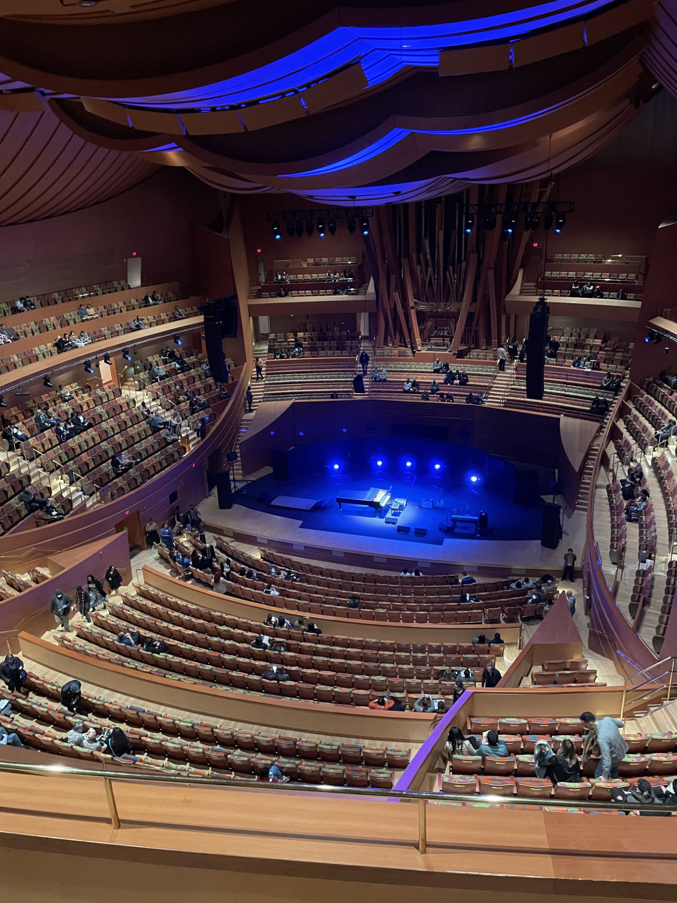

Last Saturday, we went to our 2nd [Regina Spektor](https://reginaspektor.com) concert this year. We went to see her at Walt Disney Concert Hall in LA back in March, and had a really great time. After we came back home, I saw she was coming to Woodinville, WA, about 3 miles from our house.

^^^

I’ve been liking her since college, when I was still living in Beijing, China. She wasn’t one of my top favorite artists back then. I started to appreciate her a lot more a few years ago, when my husband, who is a music fanatic and can tell you the billboard ranking every year in the past a few decades, started to talk about how she is a storyteller. I normally pay way more attention to the rhythms than the lyrics of a song, especially when the lyrics aren’t even in my mother tongue (Mandarin). So I started to read her lyrics while listening, there’s so much whimsy and wisdom.

However, her live performance is on a different level. This is her first tour I’ve been to, and usually I go to concerts because of being forced by my husband, I just don’t enjoy having loud sound blast into my ear (hence I always wear AirPods Pro with transparency mode on) and surrounded by overly passionate people (like the person who forces me into this situation). Although, at Walt Disney Concert Hall, because of the amazing acoustics, I didn’t put on my AirPods.

<figure>
  
  <figcaption>The Walt Disney Concert Hall</figcaption>
</figure>

She was on stage alone, no band, she sometimes sang with no instruments, most time while playing piano, at one time she was singing, playing an electronic keyboard, drumming, and stumping at the same time. She also played one song with a tap dancer and that was so much fun.

The song <cite>Becoming All Alone</cite> really touched me,  because the reason we went to LA was to stay with a friend for a week, who lost his husband last year. The 3 of us when to the concert together (and Disneyland After Dark Princess Nite), the lyrics has “I’m becoming all alone again” in its chorus, and I couldn’t help but put myself in the friend’s position (and I think he was crying during that song). But that’s not the only time I was really touched. There are usually 2 things that could bring me tears instantly, acceptance and craftsmanship, and boy did she show her craftsmanship.

Throughout the show, other than her amazing vocal and piano skills, she was so confident, relaxed, whimsical, playful, interactive, conversational, and just having a good time with herself and with the audience. If she made a mistake, there was no panicking or pretending, just made a quick joke and moved on, like how a friend would sing to you. Everything felt so effortless. She also utilized the Concert Hall’s acoustic, it felt like she was singing to you and telling you all her stories in a small and cozy room with woods burning inside the fireplace (\*crack crack crack\*).

<figure>
  
  <figcaption>Regina Spektor at her Woodinville concert</figcaption>
</figure>

Last week the Seattle area had a warm and sunny week, but on Saturday morning, it started to drizzle. First thing she said was Seattle brought the rain, she expected nothing less. But it was a good rain, the concert was at our favorite winery, we were surrounded by grasses and trees, and of course wines. The whole evening felt like an intimate camping trip, with a close friend who’s so good at singing and telling stories.

I often wish she was a bit more productive, so that I didn’t have to wait for so many years to enjoy another album. But on the other side, that’s her way, the way that brought everything I love about her. I can’t wait to listen to more stories she has to tell. Until then, her songs will keep being my go-to repeating playlist (and my husband just has to deal with that).
